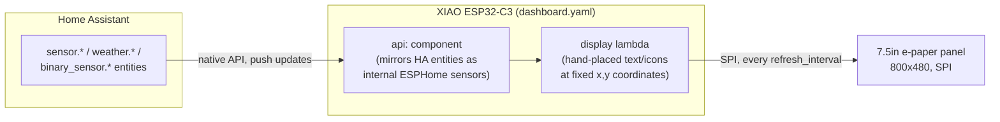
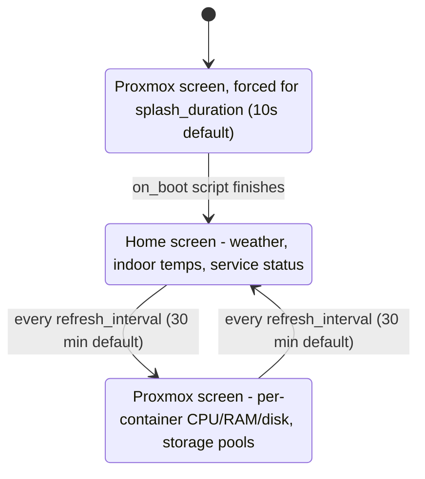

# ESPHome + Home Assistant E-Paper Dashboard

A simple, low-power dashboard using ESPHome and Home Assistant, displayed on a 7.5" e-paper panel. It shows weather, indoor/outdoor temperatures, service uptime, and Proxmox container/VM resource usage, alternating between a home screen and a Proxmox screen.


---

## Table of Contents

- [Purpose](#purpose)
- [How It Works](#how-it-works)
- [Screens](#screens)
- [Features](#features)
- [Hardware Overview](#hardware-overview)
- [Setup Instructions](#setup-instructions)
- [Customization](#customization)
- [About the Code](#about-the-code)
- [Troubleshooting](#troubleshooting)
- [Repo Contents](#repo-contents)
- [License](#license)

---

## Purpose

Provide key home and system data at a glance - without needing to unlock or tap anything. It's always visible, silent, and easy to customize. There's no app, no Lovelace dashboard, no touchscreen: just a panel on the wall that quietly reflects what Home Assistant already knows.

---

## How It Works

The device doesn't run any logic of its own - it's a thin renderer. Home Assistant owns every value shown; the ESP32 just mirrors selected entities over the native API and paints them onto the panel on a timer.



Because entity state pushes from HA update the ESP's internal sensors continuously, but the **panel itself only redraws every `refresh_interval`** (30 minutes by default) to save power and avoid wearing out the e-paper. A status footer (see below) shows when the last redraw actually happened, so stale data is obvious rather than silently looking current.

---

## Screens

There are two screens, chosen by a single `current_display_page` global that flips after every redraw. The Proxmox screen doubles as the boot splash - it's the same branch of the lambda, just forced on briefly at startup before the normal alternation begins.



| Screen | What it shows |
|---|---|
| **Home** | Location + weather condition icon, outdoor temperature and wind speed, 5 indoor/outdoor temperature readings, a service status list (9 services) with an up/down icon each, and a status footer |
| **Proxmox** | A 10-row table (CPU %, RAM %, disk %, running/stopped icon per LXC container or VM) plus a storage box summarizing 3 storage pools (used/total/percent) |

---

## Features

- 2 auto-alternating screens (plus a boot splash reusing the Proxmox layout)
- Weather condition icon, mapped from Home Assistant's `weather.*` condition string (sunny, cloudy, rainy, snowy, lightning, fog, windy, etc.)
- Status footer showing the last redraw time and whether the panel currently has a live Home Assistant API connection - so a frozen/offline panel is obvious instead of silently showing hours-old data
- Clean layout using Material Design Icons throughout (service status, weather, CPU/RAM/disk, connectivity)
- Centralized `substitutions:` block for the values people actually want to tweak first (device name, location, refresh timing, table row spacing) without touching the drawing code
- Very low energy use - no backlight, always readable, e-paper only draws power while redrawing
- Runs on a Seeed Studio **XIAO 7.5" ePaper Panel**, fully integrated and easy to install

---

## Hardware Overview

The project uses the [Seeed Studio XIAO 7.5" ePaper Panel](https://www.seeedstudio.com/XIAO-7-5-ePaper-Panel-p-6416.html?srsltid=AfmBOoo7yNJdh6ocDCPpBVsW7EUONfYskGAK5dhxONjg4-Wjx3BBmSTa), which includes:

- Built-in **XIAO ESP32-C3**, Wi-Fi capable
- 7.5" 800×480 e-paper display
- USB-C port, boot/reset buttons, and optional battery
- Tight integration with ESPHome and Home Assistant via the [Seeed wiki guide](https://wiki.seeedstudio.com/xiao_075inch_epaper_panel_esphome/)

Because the panel and driver board are one integrated unit, there's no wiring to do - the pins below are pre-wired on the board and only need to match `dashboard.yaml`. They're listed here for reference, or in case you're driving a waveshare-compatible e-paper panel from a different/bare ESP32:

| Signal | GPIO | Notes |
|---|---|---|
| SPI CLK | GPIO8 | |
| SPI MOSI | GPIO10 | |
| CS | GPIO3 | |
| DC | GPIO5 | |
| BUSY | GPIO4 | inverted |
| RESET | GPIO2 | |

Note: I plan to paint the panel matte black to blend with my setup.

---

## Setup Instructions

### 1. Install ESPHome in Home Assistant

- Go to **Settings → Add-ons → Add-on Store**
- Find ESPHome, click **Install**, then **Start**
- If it's missing, you may need a supported Home Assistant installation. For Home Assistant Container, use the ESPHome Device Builder via Docker instead.

### 2. Add a New Device in ESPHome

- Select **New Device**, choose a name (e.g., `epaper_dashboard`)
- Pick ESP32-C3 as the board, then click **Edit**

### 3. Configure secrets

- Copy [`secrets.yaml.example`](secrets.yaml.example) to `secrets.yaml` in the same `/config/esphome/` folder and fill in your Wi-Fi credentials. `dashboard.yaml` references these via `!secret wifi_ssid` / `!secret wifi_password`.

### 4. Flash the Dashboard

- Replace the auto-generated YAML with `dashboard.yaml` from this repo
- Also copy this repo's `esphome/fonts/` and `esphome/image/` folders into your Home Assistant `/config/esphome/` directory, as `fonts/` and `image/` (i.e. flat, alongside your device's YAML file) - `dashboard.yaml` references them with relative/`/config/esphome/`-rooted paths, so ESPHome won't find them otherwise
- Fill in the `api.encryption.key` and `ota.password` placeholders (ESPHome generates these for you when you create the device - paste them in, don't invent your own)
- Update the `substitutions:` block and sensor entity IDs to match your Home Assistant setup (see [Customization](#customization))

#### Flashing Options:
- **USB (initial setup)**: Click **Install → Manual Download**, then use the web uploader to flash the panel
- **OTA (subsequent updates)**: After initial setup, updates can be pushed wirelessly if `ota:` and `api:` are properly configured

For full ESPHome setup and examples, see the official [Seeed wiki](https://wiki.seeedstudio.com/xiao_075inch_epaper_panel_esphome/).

---

## Customization

This dashboard reflects my setup - a specific location, a specific set of Proxmox containers, a specific set of Uptime Kuma monitors - but the pieces below are meant to be pulled apart and reused.

### Quick knobs (`substitutions:` block)

These live at the top of `dashboard.yaml` and don't require touching any lambda code:

| Substitution | Default | Controls |
|---|---|---|
| `device_name` | `ha-dashboard` | ESPHome node name |
| `friendly_name` | `HA Dashboard` | Friendly name shown in Home Assistant |
| `location_name` | `South Queensferry` | Text shown in the top-left box on the home screen |
| `refresh_interval` | `1800s` | How often the display redraws and flips screens |
| `splash_duration` | `10s` | How long the boot splash is held before the normal cycle starts |
| `proxmox_row_height` | `32` | Vertical spacing (px) between rows in the Proxmox table |
| `service_row_height` | `40` | Vertical spacing (px) between rows in the Service Status box |

### Adding a new Proxmox container or VM row

1. Add its three resource sensors (adjust the `entity_id`s to match your Proxmox VE integration entities):

   ```yaml
   - platform: homeassistant
     id: myservice_cpu
     entity_id: sensor.lxc_myservice_109_cpu_used
     internal: true
   - platform: homeassistant
     id: myservice_ram
     entity_id: sensor.lxc_myservice_109_memory_used_percentage
     internal: true
   - platform: homeassistant
     id: myservice_disk
     entity_id: sensor.lxc_myservice_109_disk_used_percentage
     internal: true
   ```

2. Add its running-status text sensor, under `text_sensor:`:

   ```yaml
   - platform: homeassistant
     id: myservice_status
     entity_id: binary_sensor.lxc_myservice_109_status
     internal: true
   ```

3. Add a row in the lambda's Proxmox table (each row is `proxmox_row_height` px below the last - with 10 existing rows starting at `base_y = 100`, an 11th row would collide with the box's bottom edge, so either shrink `proxmox_row_height`, raise the container height in `it.rectangle(20, 20, 545, 440)`, or drop a row to make space):

   ```cpp
   draw_resource_row(base_y + 10 * row_h, "MyService", id(myservice_status).state, id(myservice_cpu).state, id(myservice_ram).state, id(myservice_disk).state);
   ```

### Adding a new temperature sensor

Add a `sensor: platform: homeassistant` entry pointing at your temperature entity, then add one `it.printf(...)` label/value pair in the "Temperature Box" section of the home screen, following the existing rows as a template.

### Changing the weather icon set

The weather icon is chosen by a plain `if / else if` chain matching Home Assistant's standard `weather.*` condition strings (`sunny`, `cloudy`, `partlycloudy`, `rainy`, `pouring`, `snowy`, `lightning`, `fog`, `windy`, etc.) against MDI glyphs. To use a different icon:

1. Look up the icon's codepoint at [pictogrammers.com/library/mdi](https://pictogrammers.com/library/mdi/) - it's shown as something like `F0599`.
2. Prefix it with `000` and `\U` to get the ESPHome escape, e.g. `\U000F0599`.
3. Add that escape to the `glyphs:` list of the font you're using it with (`font_mdi_medium` for big icons, `font_mdi_small` for inline ones) - **this step is easy to forget, and skipping it makes the icon render as a blank box**, since ESPHome only bakes the glyphs you explicitly list into the font.

### Re-ordering, resizing, or moving boxes

Every box and line of text is placed by hand at fixed `x, y` pixel coordinates on an 800×480 canvas - there's no auto-layout, so moving one element rarely affects its neighbors, but adding rows/columns can (see the Proxmox row example above for the kind of spacing math involved). Small tweaks are usually a matter of adjusting a few coordinates and re-flashing (or using OTA, which is much faster to iterate with once it's set up) to see the result.

---

## About the Code

The ESPHome code driving this display is fairly manual and hardcoded. Every element - icons, positions, font sizes, sensor mapping - is placed by hand, which makes it tricky to update or expand. There's no dynamic layout or auto-scaling, so small tweaks often require testing and adjusting coordinates little by little. The `substitutions:` block covers the values people change most often, but the box layout itself is still fixed-coordinate C++ inside the lambda.

It works for me as it is now, and I don't expect to need frequent changes. But it's definitely not plug-and-play, and there's plenty room for improvement.

I'd like to eventually improve the layout logic or even explore a different approach entirely - perhaps switching to Arduino and making direct API calls to Home Assistant for more flexibility. For now, this solution fits my needs, and it stays reliable once configured. Just be prepared for some trial and error if you decide to build your own version.

---

## Troubleshooting

| Symptom | Likely cause |
|---|---|
| An icon shows as a blank box | Its codepoint is missing from that font's `glyphs:` list (see [Changing the weather icon set](#changing-the-weather-icon-set)) |
| A value shows `nan` or `0.0` | The `entity_id` doesn't exist in Home Assistant, or the entity is `unavailable`/`unknown` - check **Developer Tools → States** in HA |
| Boot splash image looks inverted, noisy, or wrong | The source image needs to be converted to a true binary (1-bit) image first - see the reminder in [Repo Contents](#repo-contents) |
| OTA updates fail | The device must be flashed once over USB before OTA works, and the `ota:`/`api:` sections must stay configured with matching credentials |
| Footer always shows "API disconnected" | The `api.encryption.key` in `dashboard.yaml` doesn't match the key Home Assistant has stored for this device - re-add the integration or re-copy the key from the ESPHome dashboard |
| Display doesn't seem to update | This is by design between refreshes - the panel only redraws every `refresh_interval` (30 min default) to save power and reduce e-paper wear; check the footer's "Updated" timestamp before assuming it's stuck |

---

## Repo Contents

```
.
├── dashboard.yaml           # ESPHome configuration - the whole project lives here
├── secrets.yaml.example     # Template for secrets.yaml (Wi-Fi credentials)
└── esphome/
    ├── fonts/                # Inter + Material Design Icons font files
    └── image/                # Boot splash background image
```

**Reminder:** for any image to display nicely on a binary e-ink display, reformat it as a true binary image first - a tool like [onlinejpgtools.com/create-binary-jpg](https://onlinejpgtools.com/create-binary-jpg) works well.

---

## License

Feel free to use, modify, and build on this - no restrictions.

---
